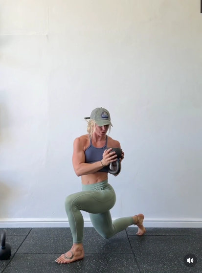

## Immagine

## Descrizione

Esercizio funzionale che combina un affondo in avanti con una torsione del busto tenendo un peso (disco o manubrio) davanti al petto. Lavora gambe e core in un unico movimento, migliorando stabilità e mobilità rotatoria del tronco.

## Muscoli Coinvolti

- **Quadricipiti**: motore principale nella discesa e risalita dell'affondo
- **Glutei**: estensione dell'anca nella risalita
- **Obliqui**: responsabili della torsione del busto
- **Core**: stabilizzazione durante la rotazione sotto carico
- **Ischiocrurali**: controllo eccentrico nella discesa

## Esecuzione

1. In piedi, afferra un disco o manubrio con entrambe le mani davanti al petto, braccia leggermente flesse
2. Fai un passo in avanti con una gamba ed esegui un affondo, scendendo fino a portare il ginocchio posteriore vicino al pavimento
3. Mantieni il busto eretto e il peso davanti al petto
4. In posizione bassa, ruota il busto verso il lato della gamba avanzata portando il peso lateralmente
5. Torna con il busto al centro
6. Spingi con il tallone della gamba avanti per risalire alla posizione di partenza
7. Ripeti alternando le gambe

## Varianti

| Variante | Effetto |
|----------|---------|
| Affondo indietro con torsione | Minore stress sul ginocchio |
| Con palla medica | Presa più comoda e naturale |
| Affondo in camminata con torsione | Maggiore componente dinamica |
| Senza peso | Versione facilitata per principianti |

## Errori Comuni

- Ginocchio anteriore che supera la punta del piede
- Ruotare anche e bacino invece del solo busto
- Perdere l'equilibrio durante la torsione
- Inclinare il busto in avanti invece di mantenerlo eretto
- Eseguire la torsione troppo velocemente senza controllo

---

### Riferimenti

- [Instagram - @fonte](https://www.instagram.com/p/DUYg_BhjRaN/?img_index=5&igsh=OW83MjYyZGs1OW5v)
