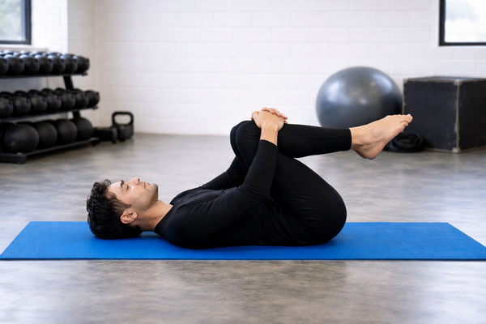

## Immagine

## Descrizione

Esercizio di stretching in cui, da posizione supina, si portano le ginocchia al petto. Uno degli esercizi più efficaci per sciogliere la zona lombare, semplice e adatto a tutti.

## Muscoli Coinvolti

- **Lombari e paravertebrali**: vengono allungati e rilassati, riducendo tensione e dolore
- **Flessori dell'anca**: l'allungamento riduce la tensione nella zona lombare
- **Glutei**: il rilassamento contribuisce ad alleviare il mal di schiena
- **Ischiocrurali**: spesso i dolori lombari derivano da tensioni in questi muscoli

## Esecuzione

1. Sdraiati supino su un tappetino con le gambe distese
2. Piega lentamente un ginocchio e portalo verso il petto
3. Afferra il ginocchio con entrambe le mani
4. Mantieni la posizione per 20-30 secondi respirando profondamente
5. Ripeti con l'altra gamba
6. Infine porta entrambe le ginocchia al petto per un allungamento più profondo

## Varianti

| Variante | Descrizione |
|----------|-------------|
| Singola gamba | Una gamba alla volta, l'altra resta distesa |
| Entrambe le ginocchia | Maggiore allungamento lombare |
| Con rotazione | Ruota i fianchi da una parte e dall'altra mantenendo le ginocchia al petto |

## Benefici

- Scioglie tensioni nella zona lombare
- Migliora la flessibilità della colonna
- Favorisce una postura più naturale
- Allevia il dolore causato da troppe ore seduti
- Corregge l'inclinazione pelvica posteriore

## Errori Comuni

- Forzare troppo tirando le ginocchia con violenza
- Trattenere il respiro invece di respirare profondamente
- Sollevare la testa e le spalle dal tappetino
- Eseguire movimenti bruschi invece che lenti e controllati

## Consigli

- Respira profondamente durante l'esercizio per rilassare i muscoli
- Non arrivare mai a un punto di dolore
- Esegui ogni movimento con calma
- Ideale al mattino o dopo lunghi periodi seduti

---

### Riferimenti

- [Stretching lombare - Easy Fit Palestre](https://www.easyfitpalestre.it/stretching-lombare-i-5-migliori-esercizi/)
- [Esercizi stretching schiena - HiPRO Danone](https://www.hipro-danone.it/esercizi-di-stretching-per-la-zona-lombare-da-includere-nel-tuo-programma-di-allenamento/)
- [Stretching schiena bassa - Donatif](https://www.donatif.com/it/blog/allenamento-ed-esercizi/stretching-mattutino-schiena-bassa)
- [Esercizi per lombalgia - Stefani Sport](https://stefanisport.it/esercizi-per-lombalgia/)
- Immagine: generata con ChatGPT
