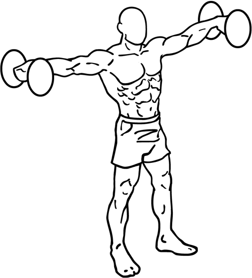

## Immagine

*(Immagine disponibile su [Wikimedia Commons](https://commons.wikimedia.org/wiki/File:Dumbbell-lateral-raises-1.png))*

## Descrizione

Esercizio di isolamento per le spalle che consiste in un'abduzione dell'omero sul piano frontale. L'obiettivo principale è allenare il capo laterale (mediale) del deltoide per sviluppare spalle larghe e definite.

## Muscoli Coinvolti

- **Deltoide laterale**: muscolo principale, picco di attivazione tra 60° e 90°
- **Sovraspinato**: attivo soprattutto nei primi 30° di abduzione
- **Deltoide anteriore**: muscolo sinergico
- **Trapezio medio e inferiore**: stabilizzatori
- **Dentato anteriore**: muscolo sinergico

## Esecuzione

1. In piedi, afferra i manubri con i palmi rivolti verso il corpo
2. Braccia lungo i fianchi, ginocchia leggermente flesse
3. Mantieni la schiena dritta e contratta
4. Solleva lentamente le braccia lateralmente (leggermente in avanti di ~30°)
5. Fermati quando i gomiti raggiungono l'altezza delle spalle (90°)
6. Mantieni i gomiti leggermente flessi durante tutto il movimento
7. Abbassa controllando il peso, senza farlo cadere

## Varianti

| Variante | Effetto |
|----------|---------|
| Ai cavi | Tensione costante durante tutto il ROM |
| Su panca inclinata | Diverso angolo di lavoro, maggiore stretch |
| Unilaterale | Corregge squilibri muscolari |
| Con elastici | Resistenza progressiva |

## Errori Comuni

- Usare slancio con la schiena (carico troppo alto)
- Ruotare i pollici verso il basso (rischio infiammazione sovraspinato)
- Alzare le spalle durante il movimento (coinvolge troppo il trapezio)
- Superare i 90° di abduzione (lavora il trapezio invece del deltoide)
- Estendere completamente i gomiti (stress articolare)

## Consigli

- Usa carichi leggeri: è un esercizio di isolamento
- Range ideale: 8-12 ripetizioni, fino a 20 per lavoro metabolico
- Lavora sul "piano scapolare" (braccia ~30° avanti rispetto al corpo)
- Concentrati sulla contrazione del deltoide, non sul peso

---

### Riferimenti

- [Alzate laterali - Project inVictus](https://www.projectinvictus.it/alzate-laterali/)
- [Alzate laterali con manubri - Alessio Ferlito](https://www.alessioferlito.it/article/alzate-laterali/)
- [Cosa allenano le alzate laterali - My Personal Trainer](https://www.my-personaltrainer.it/allenamento/cosa-allenano-le-alzate-laterali-come-si-fanno.html)
- [Guida completa alzate laterali - StarClub Fitness](https://starclubfitness.com/guida-completa-alle-alzate-laterali/)
- Immagine: [Wikimedia Commons - Dumbbell lateral raises](https://commons.wikimedia.org/wiki/File:Dumbbell-lateral-raises-1.png)
