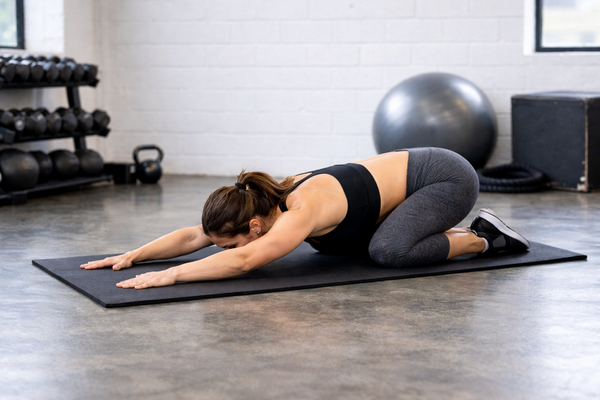

## Immagine

## Descrizione

Posizione di riposo yoga che allunga dolcemente la schiena, i fianchi e le
cosce. Il nome deriva dal sanscrito "bala" (bambino) e "asana" (posizione).
Ideale come pausa durante l'allenamento o per concludere una sessione.

## Muscoli Coinvolti

- **Erettori spinali**: allungamento passivo della colonna vertebrale
- **Latissimo del dorso**: stretching dalla colonna alle braccia
- **Grande gluteo**: allungamento e decompressione delle anche
- **Flessori dell'anca**: rilascio della tensione accumulata
- **Trapezio e deltoidi posteriori**: distensione delle spalle
- **Obliqui**: leggero allungamento laterale

## Esecuzione

1. Inginocchiati sul pavimento o su un tappetino
2. Siediti sui talloni con le braccia lungo i fianchi
3. Piegati lentamente in avanti portando lo stomaco verso le cosce
4. Cerca di mantenere i glutei a contatto con i talloni
5. Estendi le braccia in avanti con i palmi rivolti verso il basso
6. Appoggia la fronte delicatamente a terra
7. Rilassa tutto il corpo e chiudi gli occhi
8. Respira profondamente
9. Mantieni la posizione da 30 secondi a qualche minuto

## Varianti

| Variante                   | Effetto                                    |
| -------------------------- | ------------------------------------------ |
| Braccia lungo i fianchi    | Maggior rilassamento delle spalle          |
| Ginocchia divaricate       | Maggior spazio per addome, per gravidanza  |
| Braccia estese (Extended)  | Maggior allungamento di spalle e dorsali   |
| Con cuscino sotto il petto | Supporto per chi ha difficoltà a piegarsi  |

## Benefici

- Allunga schiena, fianchi, cosce, caviglie e spalle
- Riduce tensione e stress
- Attiva il sistema nervoso parasimpatico (rilassamento)
- Migliora la pressione sanguigna e la frequenza cardiaca a riposo
- Allevia l'affaticamento
- Calma la mente

## Errori Comuni

- Forzare i glutei verso i talloni causando dolore
- Trattenere il respiro invece di respirare profondamente
- Tendere le spalle verso le orecchie
- Estendere eccessivamente il collo

## Controindicazioni

- Evitare subito dopo i pasti
- Cautela in caso di lesioni a schiena, spalle o ginocchia
- In gravidanza: divaricare le ginocchia per non comprimere l'addome

---

### Riferimenti

- [Child's Pose: How to Practice Balasana - Yoga Journal](https://www.yogajournal.com/poses/child-s-pose/)
- [Child's Pose: Benefits and Instructions - WebMD](https://www.webmd.com/fitness-exercise/how-to-do-childs-pose)
- [Child's Pose in Yoga: Benefits and Variations - Cleveland Clinic](https://health.clevelandclinic.org/childs-pose)
- [Balasana - Wikipedia](https://en.wikipedia.org/wiki/Balasana)
- Immagine: generata con AI (ChatGPT/DALL-E)
