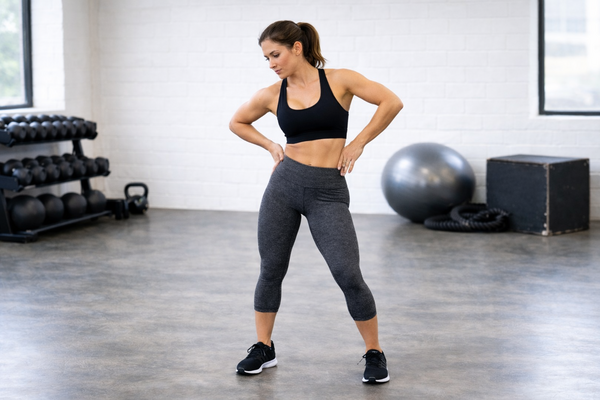

## Immagine

## Descrizione

Le circonduzioni delle anche sono un esercizio di mobilizzazione articolare
che consiste nel ruotare l'anca in modo circolare. Fondamentale nel
riscaldamento, prepara l'articolazione coxofemorale all'allenamento
aumentando la produzione di liquido sinoviale.

## Muscoli Coinvolti

- **Glutei (grande e medio)**: responsabili dell'estensione e abduzione
  dell'anca
- **Flessori dell'anca**: attivati nella fase anteriore del cerchio
- **Adduttori**: coinvolti quando la gamba si avvicina alla linea mediana
- **Core (trasverso dell'addome e obliqui)**: stabilizzano il tronco durante
  il movimento

## Esecuzione

1. In piedi, gambe alla larghezza delle spalle, mani sui fianchi
2. Solleva un ginocchio davanti a te (circa 90°)
3. Ruota il ginocchio verso l'esterno descrivendo un cerchio ampio
4. Riporta il piede a terra completando il cerchio
5. Ripeti per 5-10 cerchi in senso orario
6. Inverti la direzione per altri 5-10 cerchi
7. Cambia gamba e ripeti

## Varianti

| Variante               | Descrizione                                      |
| ---------------------- | ------------------------------------------------ |
| In quadrupedia         | Solleva ginocchio lateralmente in cerchi         |
| Con appoggio           | Mani al muro per maggiore stabilità              |
| Cerchi piccoli/grandi  | Inizia piccoli, aumenta gradualmente l'ampiezza  |
| In piedi con gamba tesa| Ruota l'intera gamba tesa (più impegnativo)      |

## Errori Comuni

- Ruotare eccessivamente il bacino invece di isolare l'anca
- Muovere il busto e le spalle durante l'esercizio
- Eseguire il movimento troppo velocemente, perdendo il controllo
- Far collassare la gamba d'appoggio

## Consigli

- Esegui l'esercizio a fine riscaldamento o inizio allenamento lower body
- Mantieni il core contratto per stabilizzare il tronco
- Se hai problemi di equilibrio, appoggiati a un muro
- 1-2 serie da 5-10 cerchi per direzione, per gamba

---

### Riferimenti

- [Hip Circles Exercise Guide - Spotebi](https://spotebi.com/exercise-guide/hip-circles/)
- [How To Perform Hip Circles - Fitness Programer](https://fitnessprogramer.com/exercise/hip-circles/)
- [Hip Circles Exercise Tutorial - Runna](https://support.runna.com/en/articles/8837242-hip-circles-exercise-tutorial)
- [Hip Circles - WorkoutLabs](https://workoutlabs.com/exercise-guide/hip-circles/)
- [Esercizi di riscaldamento - Project inVictus](https://www.projectinvictus.it/esercizi-di-riscaldamento/)
- Immagine: generata con ChatGPT
