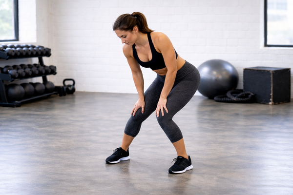

## Immagine

## Descrizione

Le circonduzioni delle ginocchia sono un esercizio di mobilizzazione articolare che prepara ginocchia e caviglie all'allenamento. Movimento semplice e fondamentale nel riscaldamento, aiuta ad alleviare rigidità e prevenire infortuni.

## Muscoli Coinvolti

- **Quadricipiti**: stabilizzano il ginocchio durante la rotazione
- **Polpacci**: coinvolti nel movimento circolare
- **Flessori del ginocchio**: attivati durante la rotazione
- **Ischiocrurali**: lavorano come muscoli secondari

## Esecuzione

1. In piedi, piedi uniti, ginocchia leggermente piegate
2. Posiziona le mani sulle ginocchia
3. Ruota lentamente le ginocchia in senso orario descrivendo cerchi
4. Mantieni i piedi ben appoggiati a terra
5. Esegui 10-15 cerchi in senso orario
6. Inverti la direzione per altri 10-15 cerchi

## Varianti

| Variante | Descrizione |
|----------|-------------|
| Cerchi piccoli | Movimento ridotto, ideale per iniziare |
| Cerchi ampi | Maggiore mobilizzazione articolare |
| Singola gamba | Una gamba alla volta per lavoro più specifico |
| Con peso | Tenendo un kettlebell per maggiore attivazione |

## Errori Comuni

- Sollevare i talloni dal pavimento
- Eseguire movimenti troppo ampi o bruschi
- Forzare oltre il range di movimento confortevole
- Tenere le gambe completamente dritte

## Consigli

- Respira lentamente e profondamente durante l'esercizio
- Inizia con cerchi piccoli, aumenta gradualmente l'ampiezza
- Mantieni il movimento fluido e controllato
- Ideale all'inizio di allenamenti lower body o full body

---

### Riferimenti

- [Knee Circles Exercise Guide - Spotebi](https://spotebi.com/exercise-guide/knee-circles/)
- [Knee Circles - Train Fitness](https://trainfitness.ai/exercises/kneeCircles)
- [Knee Circles - Skimble Workout Trainer](https://www.skimble.com/exercises/882-knee-circles-how-to-do-exercise)
- [Closed Chain Knee Circles - CRACKYL](https://www.crackyl.com/mobility-warm-up-closed-chain-knee-circles/)
- Immagine: generata con ChatGPT
