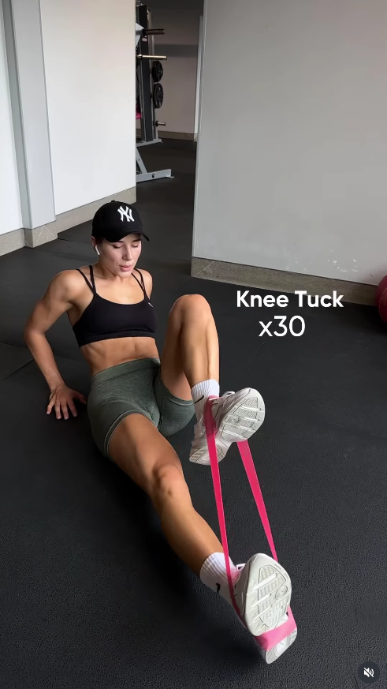

## Immagine

## Descrizione

Il knee tuck con banda elastica è un esercizio a terra per gli addominali. Seduti con il busto leggermente inclinato indietro e la banda elastica attorno ai piedi, si portano le ginocchia al petto contro la resistenza della banda e si ridistendono le gambe in modo controllato.

## Muscoli Coinvolti

- **Retto addominale**: muscolo principale, genera la flessione del tronco durante la raccolta delle ginocchia
- **Flessori dell'anca (ileo-psoas)**: sollevano le ginocchia verso il petto contro la resistenza della banda
- **Core profondo (trasverso)**: stabilizza il tronco mantenendo l'equilibrio sulla seduta
- **Obliqui**: lavorano come stabilizzatori per evitare rotazioni del busto

## Esecuzione

1. Siediti a terra con le gambe distese e avvolgi la banda elastica attorno a entrambi i piedi
2. Inclina leggermente il busto all'indietro e appoggia le mani a terra dietro di te per supporto
3. Mantieni il petto aperto e le spalle lontane dalle orecchie
4. Porta entrambe le ginocchia verso il petto contraendo gli addominali e vincendo la resistenza della banda
5. Distendi le gambe lentamente in avanti controllando il ritorno della banda
6. Non appoggiare i piedi a terra tra una ripetizione e l'altra per mantenere tensione costante
7. Ripeti per il numero di ripetizioni stabilito (es. 30)

## Varianti

| Variante | Effetto |
|----------|---------|
| Knee tuck senza banda | Versione facilitata per principianti |
| Knee tuck con banda più rigida | Aumenta la resistenza, maggiore lavoro addominale |
| Knee tuck con busto sollevato (senza mani a terra) | Maggiore attivazione del core per l'equilibrio |
| Knee tuck alternato (una gamba alla volta) | Aggiunge lavoro anti-rotazione sugli obliqui |

## Errori Comuni

- **Schiena che crolla indietro**: mantenere il busto controllato, non lasciarsi cadere all'indietro
- **Movimento troppo rapido**: controllare soprattutto la fase di distensione delle gambe
- **Spalle che salgono verso le orecchie**: tenerle basse e rilassate
- **Piedi che toccano terra tra le ripetizioni**: mantenere le gambe sollevate per tensione continua
- **Banda posizionata male**: assicurarsi che sia stabile sulla pianta dei piedi e non scivoli

---

### Riferimenti

- [Post Instagram](https://www.instagram.com/p/DR7vLxSDGwl/)
- [The Complete Guide To Knee Tucks - Gorilla Bow](https://www.gorillabow.com/blogs/news/complete-guide-to-knee-tucks)
- [Resistance Band Knee Tuck - myworkouts.io](https://www.myworkouts.io/exercise/resistance-band-knee-tuck/14628)
- [Standing Resistance Band Ab Crunch - Today.com](https://www.today.com/health/standing-resistance-band-ab-crunch-t243681)
