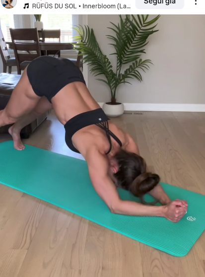

## Immagine

## Descrizione

Esercizio dinamico che parte dalla posizione di plank e porta il corpo in posizione del cane che guarda in basso (downward dog), spingendo i fianchi verso l'alto e i talloni verso il pavimento con le gambe tese. Combina lavoro di core, spalle e stretching della catena posteriore.

## Muscoli Coinvolti

- **Addominali**: motore principale nel sollevare i fianchi
- **Deltoidi**: sostegno del peso corporeo durante la pike
- **Polpacci e ischiocrurali**: allungamento attivo con gambe tese
- **Core**: stabilizzazione durante la transizione
- **Flessori dell'anca**: assistono nel portare i fianchi in alto

## Esecuzione

1. Parti in posizione di plank sulle mani, braccia tese, corpo in linea dalla testa ai piedi
2. Contrai gli addominali e spingi i fianchi verso l'alto
3. Mantieni le gambe tese e porta i talloni verso il pavimento
4. Il corpo forma una V rovesciata (downward dog), testa tra le braccia
5. Mantieni la posizione per un istante sentendo lo stretch su polpacci e ischiocrurali
6. Torna lentamente alla posizione di plank controllando la discesa
7. Ripeti in modo fluido

## Varianti

| Variante | Effetto |
|----------|---------|
| Con pausa in pike | Maggiore stretch della catena posteriore |
| Piedi su rialzo | Aumenta il carico sulle spalle |
| Pike lento (3-4 secondi) | Maggiore controllo e attivazione del core |
| Ginocchia leggermente flesse | Versione facilitata per chi ha poca flessibilità |

## Errori Comuni

- Piegare le ginocchia perdendo lo stretch
- Non spingere abbastanza i fianchi verso l'alto
- Curvare la schiena invece di mantenerla dritta
- Spostare le mani dalla posizione iniziale
- Eseguire il movimento troppo velocemente senza controllo

---

### Riferimenti

- [Instagram - @fonte](https://www.instagram.com/p/DUbf8sSj1cs/?img_index=5&igsh=MTVjcjVlZzFlYXZwaQ==)
