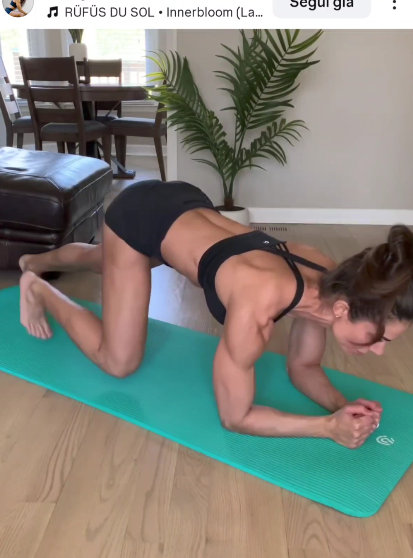

## Immagine

## Descrizione

Esercizio dinamico di core che parte dalla posizione di plank sugli avambracci. Le ginocchia vengono portate verso il petto mantenendo le gambe sempre sospese da terra, senza mai appoggiare i piedi. Ottimo per l'attivazione profonda degli addominali e dei flessori dell'anca.

## Muscoli Coinvolti

- **Retto addominale**: motore principale nella chiusura delle ginocchia al petto
- **Flessori dell'anca**: portano le ginocchia in avanti
- **Trasverso dell'addome**: stabilizzazione profonda del tronco
- **Deltoidi e tricipiti**: sostegno del corpo sugli avambracci
- **Obliqui**: stabilizzazione anti-rotazione

## Esecuzione

1. Parti in posizione di plank sugli avambracci, corpo in linea
2. Solleva i piedi dal pavimento portando le ginocchia verso il petto
3. Mantieni le gambe sospese per tutta la durata dell'esercizio
4. Estendi le gambe indietro tornando verso la posizione di plank, senza appoggiare i piedi
5. Riporta le ginocchia al petto con movimento controllato
6. Ripeti mantenendo il core sempre attivo e le gambe sospese

## Varianti

| Variante | Effetto |
|----------|---------|
| Con pausa al petto | Maggiore tempo sotto tensione sugli addominali |
| Chiusura alternata (una gamba) | Lavoro asimmetrico e anti-rotazione |
| Sulle mani invece che avambracci | Maggiore coinvolgimento delle spalle |
| Movimento lento (3 secondi) | Focus sul controllo e attivazione profonda |

## Errori Comuni

- Appoggiare i piedi a terra tra le ripetizioni
- Inarcare la zona lombare durante l'estensione delle gambe
- Sollevare i fianchi troppo in alto perdendo l'allineamento
- Trattenere il respiro invece di espirare nella chiusura
- Usare lo slancio invece del controllo addominale

---

### Riferimenti

- [Instagram - @fonte](https://www.instagram.com/p/DUbf8sSj1cs/?img_index=5&igsh=MTVjcjVlZzFlYXZwaQ==)
