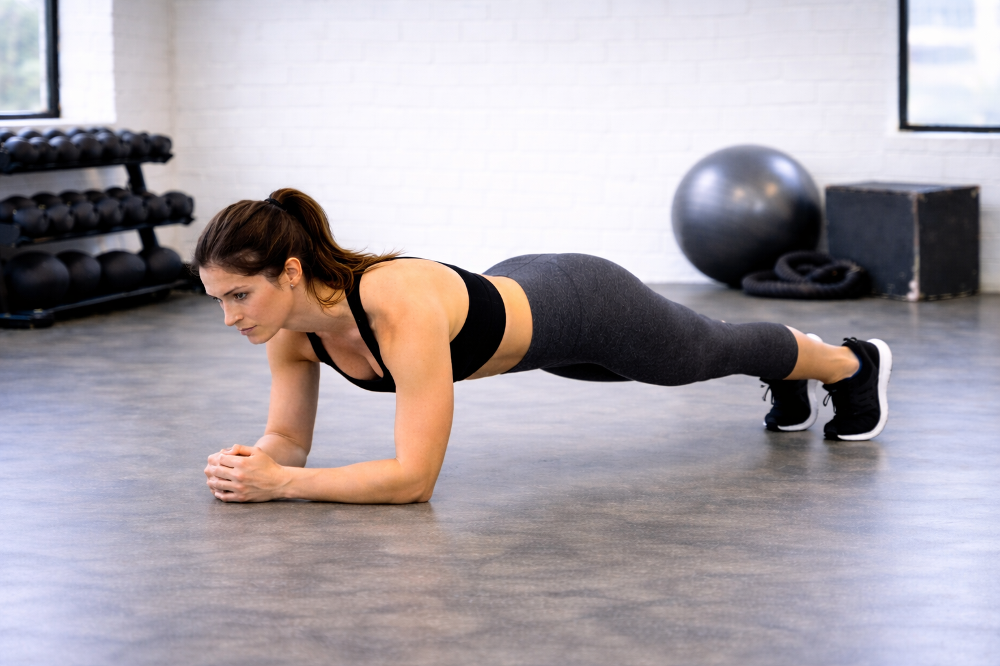

## Immagine

## Descrizione

Il plank è un esercizio isometrico fondamentale per il core. Non prevede movimenti dinamici: i muscoli lavorano per mantenere una posizione stabile e allineata. Coinvolge circa il 90% della muscolatura del corpo.

## Muscoli Coinvolti

- **Retto dell'addome**: sostiene la parte frontale del tronco
- **Trasverso dell'addome**: muscolo profondo che stabilizza la vita
- **Obliqui interni ed esterni**: controllano rotazione e inclinazione
- **Erettori spinali**: mantengono la colonna dritta
- **Glutei**: stabilizzano il bacino in posizione neutra
- **Deltoidi e trapezio**: sostengono il peso del corpo

## Esecuzione

1. Sdraiati a pancia in giù, avambracci a terra
2. Gomiti allineati direttamente sotto le spalle
3. Gambe distese, punte dei piedi a terra
4. Solleva il corpo formando una linea retta dalla testa ai talloni
5. Contrai addominali e glutei, bacino in leggera retroversione
6. Testa in posizione neutra, sguardo verso il pavimento
7. Respira in modo lungo e profondo, enfatizzando l'espirazione
8. Mantieni la posizione per 20-60 secondi

## Varianti

| Variante | Effetto |
| -------- | ------- |
| Plank a braccia tese | Maggiore coinvolgimento delle spalle |
| Plank laterale | Enfasi su obliqui e quadrato dei lombi |
| Plank inverso (supino) | Lavora glutei, paravertebrali e femorali |
| Plank con ginocchia a terra | Versione facilitata per principianti |

## Errori Comuni

- Abbassare la zona lombare aumentando la lordosi
- Sollevare troppo i fianchi (posizione a "tenda")
- Tenere il collo in iperestensione guardando avanti
- Trattenere il respiro o andare in apnea
- Non attivare il core durante l'esercizio
- Continuare quando i fianchi cedono per stanchezza

---

### Riferimenti

- [Plank: esecuzione corretta - Project inVictus](https://www.projectinvictus.it/plank-addominali/)
- [Plank: muscoli coinvolti e varianti - Alessio Ferlito](https://www.alessioferlito.it/article/plank/)
- [Plank: quali muscoli lavorano - My Personal Trainer](https://www.my-personaltrainer.it/allenamento/plank-muscoli-coinvolti.html)
