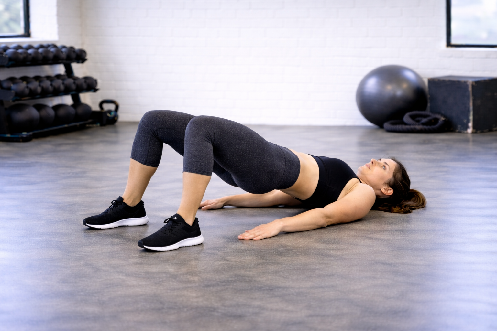

## Immagine

## Descrizione

Esercizio a corpo libero in cui, partendo da posizione supina con le ginocchia piegate, si solleva il bacino fino a formare una linea retta dal mento alle ginocchia. Ottimo per attivare e rafforzare i glutei e la catena posteriore, adatto a tutti i livelli.

## Muscoli Coinvolti

- **Grande gluteo**: motore principale dell'estensione d'anca
- **Ischiocrurali**: assistono nell'estensione d'anca e stabilizzano il ginocchio
- **Core e addominali**: stabilizzano il tronco e mantengono la retroversione del bacino
- **Polpacci**: supporto nella spinta a terra

## Esecuzione

1. Sdraiati supino con le ginocchia piegate, piedi alla larghezza delle spalle e polpacci perpendicolari al pavimento
2. Braccia distese lungo i fianchi, palmi a terra
3. Porta il bacino in retroversione già da terra, contraendo gli addominali
4. Inspira e spingi con i talloni sollevando il bacino fino a formare una linea retta dal mento alle ginocchia
5. Stringi i glutei in alto e mantieni la posizione per 2 secondi
6. Espira e scendi lentamente fino a sfiorare il pavimento senza appoggiare
7. Ripeti senza pause a terra

## Varianti

| Variante | Effetto |
|----------|---------|
| A una gamba (single leg) | Maggiore carico su un lato, corregge asimmetrie |
| Con peso sul bacino | Aumenta la resistenza e l'attivazione dei glutei |
| Ponte femorali (gambe distese, talloni a terra) | Sposta il focus sugli ischiocrurali |
| Con pulse (micro-movimenti in alto) | Aumenta il tempo sotto tensione |
| Con elastico sopra le ginocchia | Attiva anche i glutei medi per l'abduzione |

## Errori Comuni

- Inarcare la schiena sollevando la gabbia toracica prima del bacino
- Guardare il soffitto invece di mantenere il mento verso il petto (riduce la retroversione)
- Piedi troppo lontani dal bacino: sposta il lavoro sui femorali
- Piedi troppo vicini: causa iperestensione lombare
- Non contrarre i glutei nel punto più alto del movimento
- Scendere troppo velocemente senza controllare la fase eccentrica

---

### Riferimenti

- [Ponte per i glutei: la guida completa - Project inVictus](https://www.projectinvictus.it/ponte-glutei-esecuzione-corretta/)
- [Esercizio ponte per i glutei: gli errori - My Personal Trainer](https://www.my-personaltrainer.it/allenamento/esercizio-ponte-per-glutei-gli-errori-che-lo-rendono-inefficace.html)
