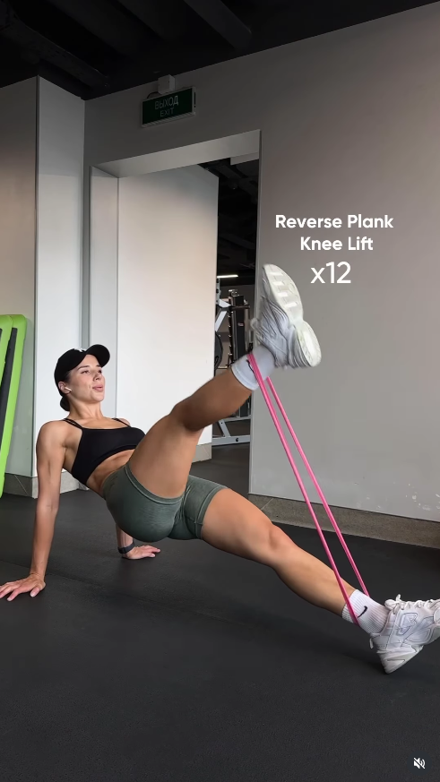

## Immagine

## Descrizione

Il reverse plank knee lift con banda elastica è un esercizio che parte dalla posizione di plank inverso (corpo rivolto verso l'alto, appoggio sulle mani dietro la schiena). Con la banda attorno ai piedi, si solleva un ginocchio alla volta verso il petto contro la resistenza elastica, combinando stabilità del core con lavoro su glutei e flessori dell'anca.

## Muscoli Coinvolti

- **Glutei e ischiocrurali**: mantengono i fianchi sollevati nella posizione di reverse plank
- **Core (retto addominale, trasverso)**: stabilizza il tronco durante il sollevamento del ginocchio
- **Flessori dell'anca**: sollevano il ginocchio contro la resistenza della banda
- **Tricipiti e deltoidi posteriori**: sostengono il peso del corpo sulle braccia
- **Quadricipiti**: lavorano per vincere la resistenza della banda nel sollevamento

## Esecuzione

1. Siediti a terra con le gambe distese e la banda elastica attorno a entrambi i piedi
2. Posiziona le mani a terra dietro la schiena con le dita rivolte verso i piedi
3. Premi sulle mani e solleva i fianchi dal pavimento, formando una linea retta dalle spalle ai talloni
4. Mantieni il petto aperto e le spalle lontane dalle orecchie
5. Solleva un ginocchio verso il petto vincendo la resistenza della banda
6. Riporta il piede a terra in modo controllato
7. Alterna le gambe per il numero di ripetizioni stabilito (es. 12 per lato)

## Varianti

| Variante | Effetto |
|----------|---------|
| Reverse plank statico (senza knee lift) | Versione facilitata, solo isometria |
| Senza banda | Riduce la resistenza sul sollevamento del ginocchio |
| Con banda più rigida | Aumenta il lavoro su flessori dell'anca e quadricipiti |
| Reverse plank leg raise (gamba tesa) | Maggiore lavoro sui flessori dell'anca, meno sui quadricipiti |

## Errori Comuni

- **Fianchi che cadono verso il basso**: mantenere i glutei attivi per tutta la serie
- **Spalle che salgono verso le orecchie**: premere bene sulle mani e aprire il petto
- **Movimento troppo rapido**: controllare sia il sollevamento che il ritorno del ginocchio
- **Testa che cade indietro**: mantenere il collo in linea con la colonna
- **Polsi sovraccaricati**: distribuire il peso su tutta la mano, non solo sul palmo

---

### Riferimenti

- [Post Instagram](https://www.instagram.com/p/DR7vLxSDGwl/)
- [How to Do a Reverse Plank - Hinge Health](https://www.hingehealth.com/resources/articles/reverse-plank/)
- [Reverse Plank - Lift Manual](https://liftmanual.com/reverse-plank/)
- [Band Reverse Plank - Spotebi](https://spotebi.com/exercise-guide/band-reverse-plank/)
