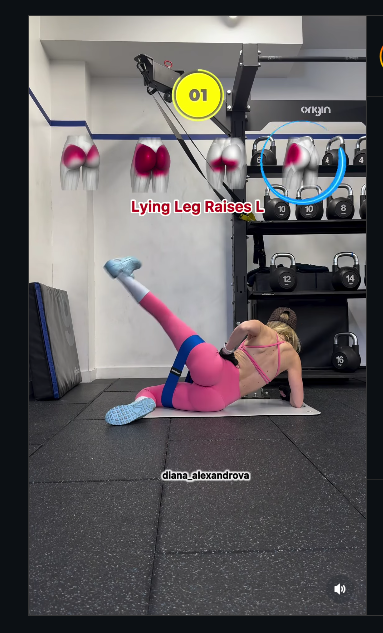

## Immagine

## Descrizione

Routine a 4 fasi per l'attivazione e il rinforzo dei glutei utilizzando una
banda elastica. Gli esercizi vengono eseguiti in posizione quadrupede e in
ginocchio, permettendo di isolare efficacemente i glutei con resistenza
progressiva.

## Muscoli Coinvolti

- **Gluteo grande**: motore principale dell'estensione dell'anca
- **Gluteo medio e piccolo**: stabilizzatori e abduttori dell'anca
- **Core (trasverso, obliqui)**: stabilizzazione del tronco durante i movimenti
- **Ischiocrurali**: assistono nell'estensione dell'anca

## Le 4 Fasi

### Fase 1: Donkey Kick con Elastico

**Posizione**: Quadrupede con elastico attorno alle cosce o ai piedi.

**Esecuzione**:

1. Parti in posizione quadrupede (mani sotto le spalle, ginocchia sotto i fianchi)
2. Mantieni il core attivo e la schiena neutra
3. Estendi una gamba all'indietro e verso l'alto, ginocchio piegato a 90°
4. Spingi il piede verso il soffitto contraendo il gluteo
5. Torna controllato alla posizione iniziale
6. Ripeti per le ripetizioni desiderate, poi cambia lato

### Fase 2: Fire Hydrant con Elastico (Apertura Laterale)

**Posizione**: Quadrupede con elastico attorno alle cosce.

**Esecuzione**:

1. Dalla posizione quadrupede, mantieni il ginocchio piegato a 90°
2. Solleva lateralmente la gamba mantenendo l'angolo del ginocchio
3. Apri l'anca portando il ginocchio verso l'esterno
4. Mantieni il bacino stabile, evita rotazioni del tronco
5. Torna controllato e ripeti
6. Esegui tutte le ripetizioni su un lato, poi cambia

### Fase 3: Pull-Through in Ginocchio

**Posizione**: In ginocchio con elastico fissato davanti a sé.

**Esecuzione**:

1. Posizionati in ginocchio, elastico teso davanti
2. Afferra l'elastico con entrambe le mani tra le gambe
3. Inclina il busto leggermente in avanti con schiena neutra
4. Estendi le anche portando il bacino in avanti
5. Contrai i glutei al massimo in posizione eretta
6. Torna controllato alla posizione iniziale

### Fase 4: Kickback con Elastico

**Posizione**: Quadrupede con elastico attorno ai piedi.

**Esecuzione**:

1. Dalla posizione quadrupede, aggancia l'elastico al piede
2. Estendi completamente la gamba all'indietro
3. Mantieni la gamba in linea con il corpo o leggermente sopra
4. Contrai il gluteo al massimo dell'estensione
5. Torna controllato senza appoggiare il ginocchio
6. Completa le ripetizioni e cambia lato

## Protocollo Consigliato

| Fase | Ripetizioni | Serie |
| ------ | ------------- | ------- |
| Fase 1 - Donkey Kick | 12-15 per lato | 3 |
| Fase 2 - Fire Hydrant | 12-15 per lato | 3 |
| Fase 3 - Pull-Through | 15-20 | 3 |
| Fase 4 - Kickback | 12-15 per lato | 3 |

## Errori Comuni

- Inarcare eccessivamente la zona lombare durante le estensioni
- Ruotare il bacino durante il fire hydrant
- Usare lo slancio invece del controllo muscolare
- Trattenere il respiro (espira durante la fase di sforzo)
- Scegliere un elastico troppo rigido che compromette la tecnica

## Consigli

- Esegui la routine come riscaldamento prima di squat o stacchi
- Può essere usata anche come allenamento a sé stante per i glutei
- Aumenta progressivamente la resistenza dell'elastico
- Concentrati sulla contrazione del gluteo, non sull'altezza del movimento

---

### Riferimenti

- Video originale: [Instagram Reel - @mangesdesfruits](https://www.instagram.com/reel/DSw7SA4jSPf/)
- Immagini: screenshot dal reel Instagram di @mangesdesfruits
