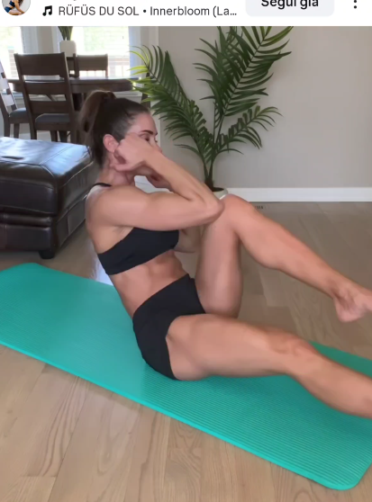

## Immagine

## Descrizione

Variante del Russian Twist con le mani dietro la testa. Seduti con le gambe sollevate, si ruota il busto portando il gomito a toccare il ginocchio opposto alternando i lati. Attiva in modo intenso gli obliqui e il retto addominale.

## Muscoli Coinvolti

- **Obliqui**: motore principale nella rotazione del busto
- **Retto addominale**: mantiene il busto sollevato
- **Flessori dell'anca**: tengono le gambe sospese
- **Trasverso dell'addome**: stabilizzazione profonda

## Esecuzione

1. Siediti a terra, piega leggermente le ginocchia e solleva i piedi dal pavimento
2. Inclina il busto leggermente indietro mantenendo la schiena dritta
3. Porta le mani dietro la testa con i gomiti larghi
4. Ruota il busto portando il gomito destro verso il ginocchio sinistro
5. Torna al centro e ruota dall'altro lato, gomito sinistro verso ginocchio destro
6. Mantieni le gambe sempre sollevate durante tutto il movimento
7. Alterna i lati con ritmo controllato

## Varianti

| Variante | Effetto |
|----------|---------|
| Russian twist classico (mani avanti) | Più semplice, minor leva sulle braccia |
| Con peso tra le mani | Maggiore resistenza sugli obliqui |
| Gambe tese | Maggiore attivazione dei flessori dell'anca |
| Con pausa gomito-ginocchio | Maggiore contrazione di picco sugli obliqui |

## Errori Comuni

- Tirare il collo con le mani invece di ruotare il busto
- Appoggiare i piedi a terra tra le ripetizioni
- Ruotare solo le spalle senza coinvolgere il tronco
- Perdere la posizione del busto inclinato indietro
- Eseguire il movimento troppo velocemente perdendo il controllo

---

### Riferimenti

- [Instagram - @fonte](https://www.instagram.com/p/DUbf8sSj1cs/?img_index=5&igsh=MTVjcjVlZzFlYXZwaQ==)
