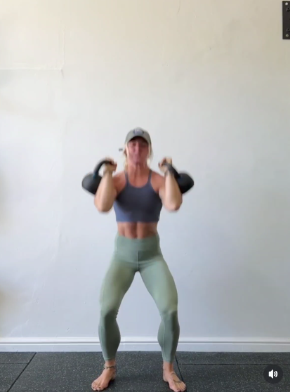

## Immagine

## Descrizione

Esercizio composto che combina uno squat con un'alzata dei kettlebell alla posizione di rack. Si parte con i kettlebell in basso, si scende in squat e durante la risalita si portano i kettlebell alle spalle con un movimento esplosivo. Ottimo per allenamenti funzionali total body.

## Muscoli Coinvolti

- **Quadricipiti**: motore principale nella fase di squat
- **Glutei**: estensione dell'anca nella risalita
- **Deltoidi**: stabilizzazione e alzata dei kettlebell
- **Trapezio**: trazione verso l'alto durante il clean
- **Core**: stabilizzazione durante tutto il movimento
- **Avambracci**: presa e controllo dei kettlebell

## Esecuzione

1. In piedi, piedi leggermente oltre la larghezza delle spalle, punte leggermente extraruotate
2. Afferra un kettlebell per mano con le braccia distese lungo il corpo
3. Scendi in squat piegando anche e ginocchia, schiena dritta e petto in fuori
4. Scendi fino a quando le cosce sono parallele al pavimento
5. Spingi con forza attraverso i talloni per risalire
6. Sfrutta la spinta delle gambe per portare i kettlebell in posizione di rack (alle spalle, gomiti alti)
7. Controlla la posizione di rack per un istante
8. Abbassa i kettlebell lungo il corpo tornando alla posizione iniziale
9. Ripeti fluidamente

## Varianti

| Variante | Effetto |
|----------|---------|
| Con singolo kettlebell | Lavoro anti-rotazione del core |
| Con pausa in basso | Maggiore tempo sotto tensione sulle gambe |
| Sumo stance | Maggiore attivazione adduttori |
| Senza clean (goblet squat doppio) | Focus solo sulle gambe |

## Errori Comuni

- Curvare la schiena durante la discesa
- Sollevare i talloni dal pavimento
- Non coordinare la spinta delle gambe con l'alzata dei kettlebell
- Gomiti troppo bassi nella posizione di rack
- Usare solo le braccia per alzare i kettlebell invece di sfruttare la spinta esplosiva delle gambe

---

### Riferimenti

- [Instagram - @fonte](https://www.instagram.com/p/DUYg_BhjRaN/?img_index=5&igsh=OW83MjYyZGs1OW5v)
