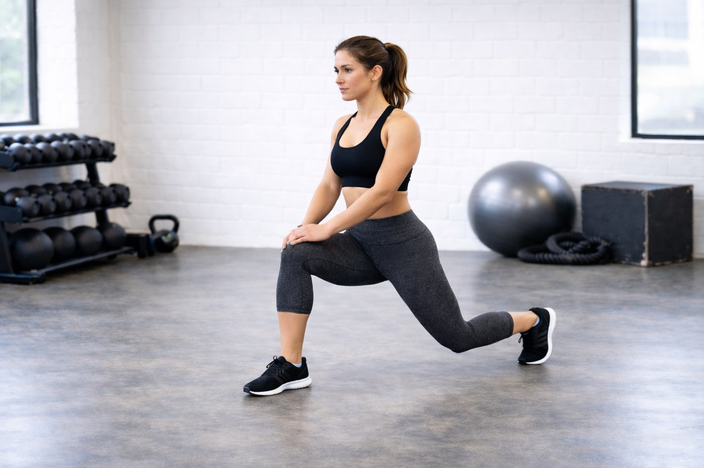

## Immagine

## Descrizione

Esercizio di allungamento per i flessori dell'anca, in particolare
l'ileo-psoas. Eseguito in posizione di affondo con il ginocchio posteriore
a terra, è fondamentale per chi passa molte ore seduto e per migliorare la
mobilità dell'anca.

## Muscoli Coinvolti

- **Ileo-psoas**: flessore primario dell'anca, muscolo principale allungato
- **Retto femorale**: parte del quadricipite, viene stirato
- **Tensore della fascia lata**: coinvolto nell'allungamento
- **Addominali**: attivi per mantenere il busto eretto

## Esecuzione

1. Inginocchiati su un tappetino, porta un piede avanti con ginocchio a 90°
2. Il ginocchio posteriore resta a terra, gamba distesa dietro
3. Mantieni il busto eretto, mani sul ginocchio anteriore
4. Contrai leggermente gli addominali per stabilizzare il bacino
5. Spingi lentamente il bacino in avanti e verso il basso
6. Senti l'allungamento nella parte anteriore dell'anca posteriore
7. Mantieni la posizione per 20-30 secondi
8. Ripeti sull'altro lato

## Varianti

| Variante                     | Effetto                           |
| ---------------------------- | --------------------------------- |
| Mani dietro la schiena       | Maggiore sfida per l'equilibrio   |
| Braccio alzato (stesso lato) | Aumenta l'allungamento laterale   |
| Con rotazione del busto      | Coinvolge anche gli obliqui       |
| Piede posteriore sollevato   | Aggiunge stretch al quadricipite  |

## Errori Comuni

- Inclinarsi troppo in avanti con il busto
- Non contrarre gli addominali (causa iperlordosi lombare)
- Affondare troppo velocemente rischiando stiramenti
- Ginocchio anteriore che supera la punta del piede

## Consigli

- Usa un tappetino o cuscino sotto il ginocchio per comfort
- Respira profondamente durante l'allungamento
- Non forzare mai fino al dolore acuto
- Ideale dopo allenamenti o lunghi periodi seduti
- 2-3 serie da 20-30 secondi per lato

---

### Riferimenti

- [Stretching flessori dell'anca - Osteopata Roma](https://osteopata-roma.com/tecniche-di-stretching-dei-flessori-dell-anca/)
- [Stretching Psoas - Accademia Flessibilità](https://accademiaflessibilita.it/stretching-psoas-come-allungare-il-muscolo-dellanima-con-4-facili-esercizi/)
- [Stretching Psoas - Alimentazione Sportiva](https://alimentazionesportiva.it/stretching-psoas/)
- [Muscolo Ileopsoas - Myprotein](https://www.myprotein.it/thezone/allenamento/muscolo-ileopsoas-infiammazione-stretching/)
- Immagine: generata con ChatGPT
