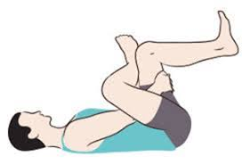

## Immagine

## Descrizione

Esercizio di allungamento per il muscolo piriforme eseguito in posizione supina. Fondamentale per chi soffre di tensioni al gluteo o sindrome del piriforme, aiuta a prevenire la compressione del nervo sciatico e migliora la mobilità dell'anca.

## Muscoli Coinvolti

- **Piriforme**: muscolo principale allungato, rotatore esterno dell'anca
- **Grande gluteo**: viene stirato insieme al piriforme
- **Rotatori esterni dell'anca**: otturatori, gemelli, quadrato del femore
- **Medio gluteo**: coinvolto nell'allungamento

## Esecuzione

1. Sdraiati supino con le gambe piegate, piedi a terra
2. Porta la caviglia di una gamba sul ginocchio opposto (posizione "a 4")
3. Mantieni il piede attivo (non rilassato) per proteggere il ginocchio
4. Afferra con entrambe le mani la coscia della gamba d'appoggio
5. Tira delicatamente la coscia verso il petto
6. Senti l'allungamento nel gluteo della gamba incrociata
7. Mantieni per 30 secondi respirando profondamente
8. Ripeti sull'altro lato

## Varianti

| Variante | Effetto |
|----------|---------|
| Senza tirare la coscia | Versione più leggera per principianti |
| Gamba d'appoggio tesa a terra | Maggiore isolamento del piriforme |
| Seduto su sedia | Versione da ufficio |
| In piedi (pigeon stretch) | Versione più avanzata |

## Errori Comuni

- Rilassare il piede della gamba incrociata (rischio per il ginocchio)
- Tirare troppo forte causando dolore acuto
- Sollevare la testa e le spalle dal pavimento
- Non respirare durante l'allungamento

## Consigli

- Esegui l'esercizio almeno 3 volte a settimana
- Interrompi se il dolore peggiora
- Più porti la coscia al petto, più intenso è l'allungamento
- Ideale dopo lunghi periodi seduti o dopo corsa
- 3-5 serie da 30 secondi per lato

---

### Riferimenti

- [Piriforme: anatomia e esercizi - Project inVictus](https://www.projectinvictus.it/piriforme/)
- [Stretching piriforme - Daniele Anelli](https://www.danieleanelli.it/stretching-piriforme/)
- [Esercizi per il piriforme - Buddyfit](https://www.buddyfit.club/mybuddy-it/esercizi-per-il-piriforme-5-modi-per-alleviare-il-dolore)
- [Stretching piriforme - Obiettivo Salute](https://www.obiettivosalute.ch/stretching-piriforme/)
- [Sindrome del Piriforme - Studio CE.MA. Sport](https://www.studiocemasport.it/webroot/2020/04/08/sindrome-del-piriforme-4-semplici-esercizi-da-fare-a-casa/)
- Immagine: da web
