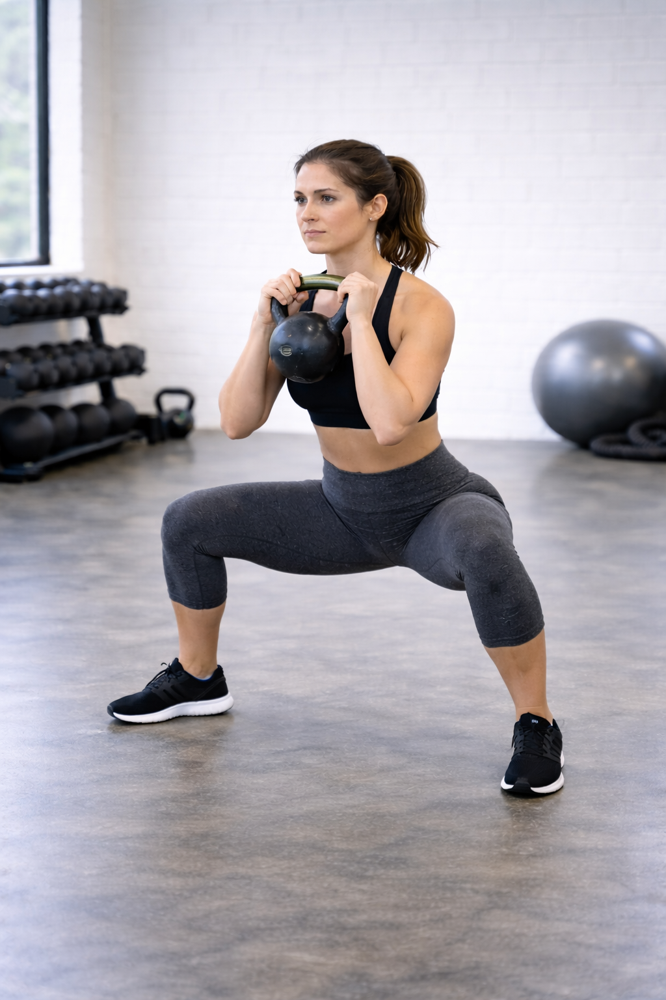

## Immagine

## Descrizione

Il sumo squat è una variante dello squat tradizionale caratterizzata da una posizione delle gambe molto più ampia e con le punte dei piedi rivolte verso l'esterno. Questo esercizio enfatizza particolarmente il lavoro su glutei e adduttori rispetto allo squat classico.

## Muscoli Coinvolti

- **Glutei**: muscolo principale, maggiormente attivato grazie alla posizione ampia e alla profondità del movimento
- **Adduttori**: fortemente coinvolti per la stabilizzazione e il movimento con stance larga
- **Quadricipiti**: responsabili dell'estensione del ginocchio
- **Hamstring**: assistono nel movimento di risalita
- **Core ed erettori spinali**: mantengono la postura eretta e stabilizzano la colonna

## Esecuzione

1. Posizionati con i piedi più larghi delle spalle, punte dei piedi ruotate verso l'esterno a circa 45 gradi
2. Mantieni la schiena dritta e il petto alto
3. Inizia il movimento portando i fianchi indietro e piegando le ginocchia
4. Scendi fino a quando le cosce sono parallele al pavimento (o leggermente sotto)
5. Le ginocchia devono seguire la direzione delle punte dei piedi
6. Spingi attraverso i talloni e la parte centrale del piede per risalire
7. Contrai i glutei in cima al movimento

## Varianti

| Variante | Effetto |
|----------|---------|
| Sumo squat con manubrio | Aggiunge resistenza, manubrio tenuto tra le gambe |
| Sumo squat con kettlebell | Simile al manubrio, presa più naturale |
| Sumo squat pulsato | Maggiore tempo sotto tensione sui muscoli |
| Sumo squat con salto | Aggiunge componente esplosiva e cardio |

## Errori Comuni

- **Ginocchia che cedono verso l'interno**: causato da glutei deboli o peso eccessivo
- **Schiena che si arrotonda**: indica core debole o mobilità insufficiente
- **Talloni che si sollevano**: segnala mobilità limitata delle caviglie
- **Non scendere abbastanza**: riduce l'attivazione dei glutei
- **Peso troppo sulle punte dei piedi**: sposta il carico sui quadricipiti invece che sui glutei

---

### Riferimenti

- [Sumo Squat: How-To, Benefits, and Muscles Worked - Healthline](https://www.healthline.com/health/fitness-exercise/sumo-squat-exercises)
- [How to Do the Sumo Squat - Men's Health](https://www.menshealth.com/uk/how-tos/a752985/sumo-squat/)
- [Sumo Squat Ultimate Guide - BOXROX](https://www.boxrox.com/sumo-squat-benefits-muscles-worked-technique/)
- [How to Do Sumo Squat - StrengthLog](https://www.strengthlog.com/sumo-squat/)
