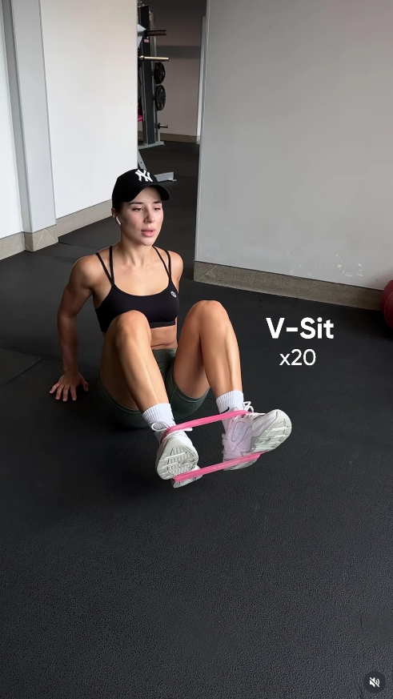
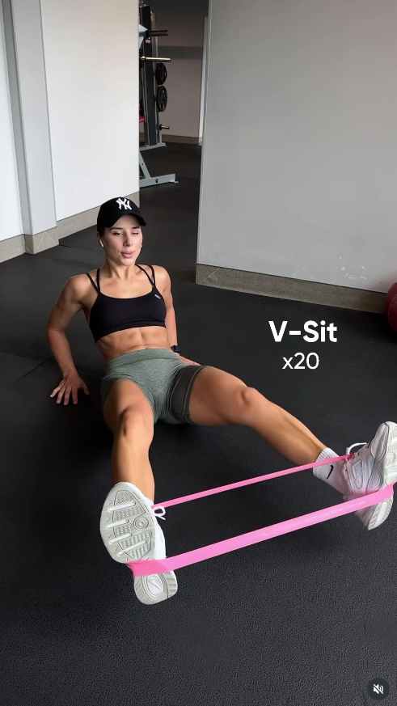

## Immagine

## Descrizione

Il V-sit con banda elastica è un esercizio a terra per gli addominali. Seduti con la banda attorno ai piedi, si distendono le gambe in avanti e si inclina il busto indietro, per poi raccogliere gambe e tronco simultaneamente formando una V. La banda aggiunge resistenza alla distensione delle gambe, aumentando il lavoro del core.

## Muscoli Coinvolti

- **Retto addominale**: muscolo principale, genera la flessione del tronco nella fase di chiusura a V
- **Flessori dell'anca (ileo-psoas)**: sollevano le gambe e le portano verso il busto contro la resistenza della banda
- **Trasverso dell'addome**: stabilizza il tronco durante tutto il movimento
- **Obliqui**: lavorano come stabilizzatori per mantenere l'equilibrio sulla seduta
- **Quadricipiti**: mantengono le gambe tese durante il movimento

## Esecuzione

1. Siediti a terra con le gambe distese e avvolgi la banda elastica attorno a entrambi i piedi
2. Inclina il busto leggermente indietro e solleva le gambe dal pavimento
3. Distendi le gambe in avanti e il busto all'indietro, mantenendo entrambi sollevati da terra
4. Contrai gli addominali e porta contemporaneamente le ginocchia verso il petto e il busto in avanti, formando una V
5. Controlla la fase di ritorno distendendo gambe e busto lentamente contro la resistenza della banda
6. Non appoggiare né i piedi né la schiena a terra tra le ripetizioni
7. Ripeti per il numero di ripetizioni stabilito (es. 20)

## Varianti

| Variante | Effetto |
|----------|---------|
| V-sit senza banda | Versione facilitata per principianti |
| V-sit con gambe tese (senza piegare le ginocchia) | Maggiore lavoro su flessori dell'anca e addominali |
| V-sit con banda più rigida | Aumenta la resistenza, maggiore intensità |
| V-sit con pausa in posizione chiusa | Aumenta il tempo sotto tensione sugli addominali |

## Errori Comuni

- **Schiena che si arrotonda**: mantenere il petto aperto e la colonna il più neutra possibile
- **Movimento incontrollato nella fase eccentrica**: rallentare la distensione di gambe e busto
- **Piedi o schiena che toccano terra**: mantenere tensione continua sugli addominali
- **Trattenere il respiro**: espirare durante la chiusura a V, inspirare durante la distensione
- **Banda che scivola dai piedi**: posizionarla bene sulla pianta prima di iniziare

---

### Riferimenti

- [Post Instagram](https://www.instagram.com/p/DR7vLxSDGwl/)
- [V Sit - Spotebi](https://spotebi.com/exercise-guide/v-sit/)
- [How to Master the V-Sit - Peloton](https://www.onepeloton.com/blog/v-sit)
