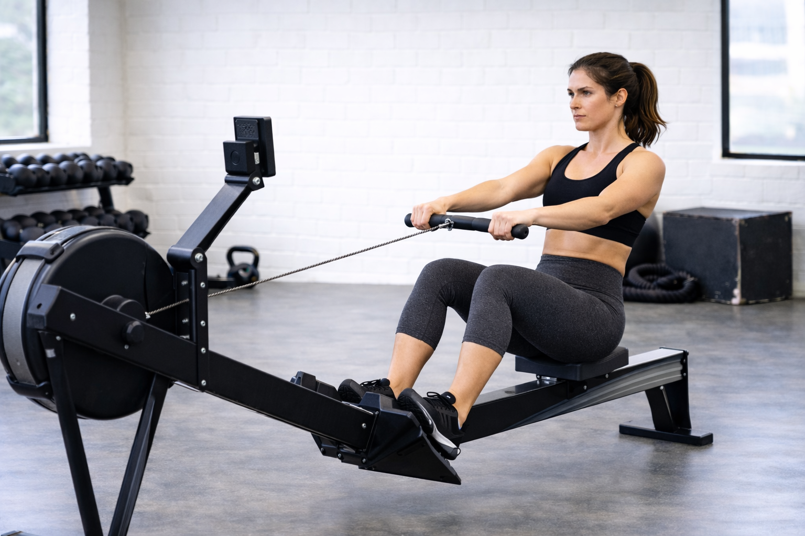

## Immagine

## Descrizione

Il vogatore è un'ottima scelta per il riscaldamento pre-allenamento. A bassa intensità attiva circa l'85% dei muscoli del corpo senza impatti articolari, preparando gambe, schiena e braccia per la sessione successiva.

## Muscoli Coinvolti

- **Quadricipiti e femorali**: spinta delle gambe (65-75% del lavoro)
- **Dorsali e romboidi**: trazione del remo
- **Deltoidi e bicipiti**: movimento delle braccia
- **Core e lombari**: stabilizzazione del tronco
- **Glutei**: estensione dell'anca nella spinta

## Esecuzione

1. Siediti sul sedile, piedi fissati nelle apposite staffe
2. Afferra il manubrio con presa overhand, braccia distese
3. **Fase di spinta**: spingi con le gambe mantenendo le braccia tese
4. **Fase di trazione**: quando le gambe sono quasi estese, tira il manubrio verso l'ombelico
5. Gomiti indietro e paralleli al corpo, non aperti
6. Torna alla posizione iniziale controllando il movimento
7. Mantieni un ritmo costante e moderato (18-22 colpi/minuto per il riscaldamento)

## Parametri per Riscaldamento

| Parametro | Valore Consigliato |
| --------- | ------------------ |
| Durata | 5-10 minuti |
| Intensità | Bassa-moderata |
| Ritmo | 18-22 colpi/minuto |
| Resistenza | Livello 3-5 su 10 |

## Errori Comuni

- Aprire i gomiti verso l'esterno invece che indietro
- Tirare il manubrio verso il petto invece che verso l'ombelico
- Iperestendere le ginocchia a fine spinta
- Piegare la schiena in avanti o indietro eccessivamente
- Usare solo le braccia senza coinvolgere le gambe
- Partire troppo veloce o con troppa resistenza

## Benefici per il Riscaldamento

- Attiva il sistema cardiovascolare gradualmente
- Scalda tutti i principali gruppi muscolari
- Zero impatto sulle articolazioni
- Migliora la mobilità di spalle e anche
- Prepara il corpo per allenamenti di forza o cardio

---

### Riferimenti

- [Vogatore: muscoli coinvolti e benefici - Melarossa](https://www.melarossa.it/fitness/workout/vogatore/)
- [Allenamento con vogatore - My Personal Trainer](https://www.my-personaltrainer.it/allenamento/allenamento-con-vogatore-efficacia-e-programmi.html)
- [Vogatore benefici - Decathlon](https://consigli-sport.decathlon.it/quali-sono-i-muscoli-che-lavorano-con-il-vogatore)
