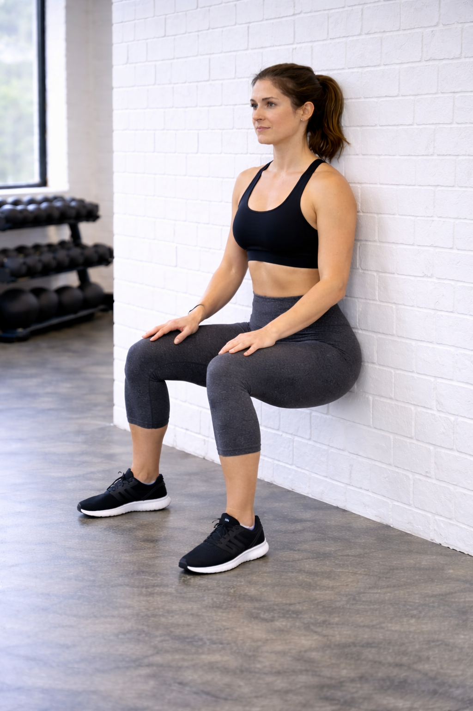

## Immagine

## Descrizione

Il wall sit è un esercizio isometrico in cui si mantiene una posizione di squat con la schiena appoggiata al muro. È un esercizio semplice ma efficace per costruire resistenza muscolare nelle gambe senza necessità di attrezzature.

## Muscoli Coinvolti

- **Quadricipiti**: muscolo principale, mantiene la posizione contro la gravità
- **Glutei**: stabilizzano il bacino e supportano la posizione
- **Hamstring**: lavorano in sinergia con i quadricipiti
- **Polpacci**: contribuiscono alla stabilizzazione
- **Adduttori**: mantengono le gambe in posizione
- **Core**: stabilizza il tronco e mantiene la postura

## Esecuzione

1. Appoggia la schiena completamente contro il muro
2. Posiziona i piedi alla larghezza delle spalle, a circa 50-60 cm dal muro
3. Scivola verso il basso piegando le ginocchia fino a formare un angolo di 90 gradi
4. Le cosce devono essere parallele al pavimento
5. Le ginocchia devono essere allineate sopra le caviglie, non oltre le punte dei piedi
6. Mantieni la schiena piatta contro il muro e il core contratto
7. Tieni la posizione per 20-60 secondi
8. Risali scivolando lungo il muro

## Varianti

| Variante | Effetto |
| -------- | ------- |
| Wall sit con palla | Aggiunge instabilità, maggiore attivazione del core |
| Wall sit su una gamba | Aumenta il carico su una gamba sola |
| Wall sit con peso | Aggiunge resistenza tenendo un disco o manubrio |
| Wall sit con adduzione | Stringere una palla tra le ginocchia attiva gli adduttori |

## Errori Comuni

- **Ginocchia oltre le punte dei piedi**: aumenta lo stress sulle articolazioni
- **Angolo superiore a 90 gradi**: riduce l'efficacia dell'esercizio
- **Schiena che si stacca dal muro**: compromette la postura corretta
- **Trattenere il respiro**: continuare a respirare normalmente
- **Piedi troppo vicini al muro**: rende difficile mantenere l'angolo corretto

---

### Riferimenti

- [9 Benefits of Wall Sits - Cleveland Clinic](https://health.clevelandclinic.org/wall-sits)
- [Wall Sits: Helpful Tips and Benefits - NASM](https://blog.nasm.org/wall-sits)
- [6 Benefits of Wall Sit Exercises - GoodRx](https://www.goodrx.com/well-being/movement-exercise/wall-sit-benefits)
- [Master the Wall Sit - ISSA](https://www.issaonline.com/blog/post/master-the-wall-sit-good-form-variations-common-mistakes)
- [Imaginary chair - Wikipedia](https://en.wikipedia.org/wiki/Imaginary_chair)
